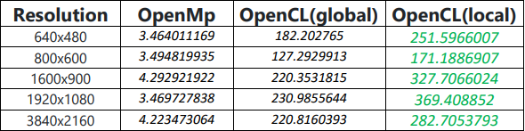
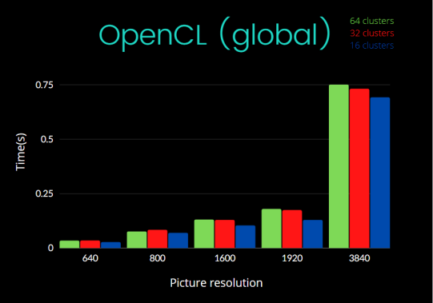
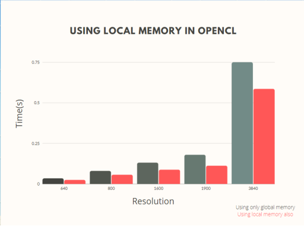
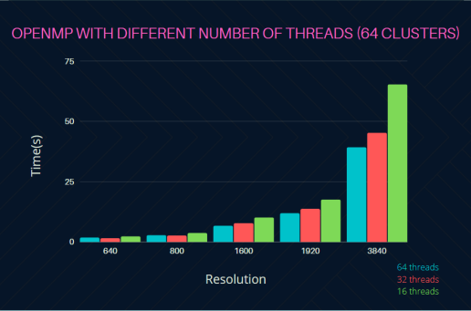

# Compression
## Summary
This is a representation of compressing pictures with different algorithms using kNN algorithm. The code includes serial algorithm, algorithm that is parallelyzed on CPU and algorythm that is parallelyzed on GPU.

## Speedup
By using parallelization, I have achieved the speedup of more than 200 times for the serial algorithm over pictures with different resolution.

## Number of clusters
I have also analyzed the speed of the algorithms using different number of clusters in kNN algorithm. The picture below shows speed of the compression using OpenCL code for parallelization with different number of clusters.

## Local vs Global memory
When writing OpenCL code for parallelization, you can optimize the code by using local memory objects for each Compute Unit so the memory acess takes less clock cycles than acessing global memory objects. In the picture below you can see the difference in time to compress the pictures using global memory only and using gloabal and local memory combined.

## Number of threads
I have also tested the OpenMP algorithm by using different number of threads.

 
